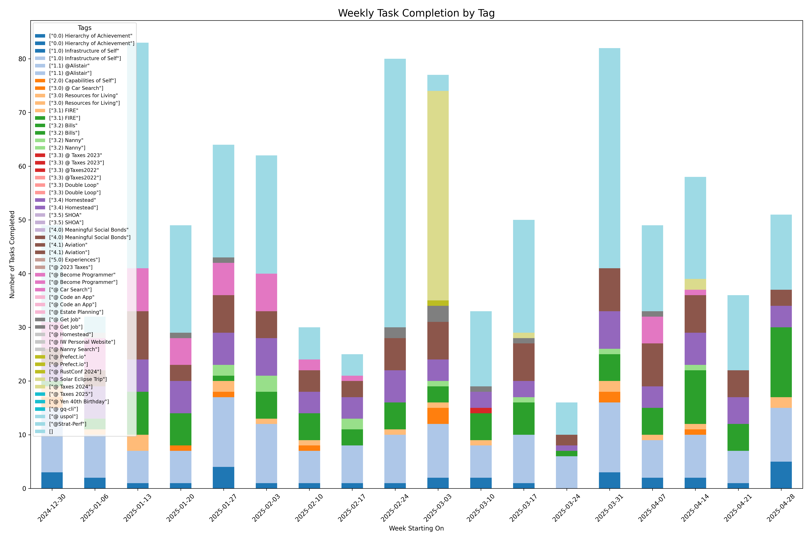

# README.md

## Description
A quick and dirty bar chart of [gqueues](https://gqz.page.link/Rvzp98m6wrY9E27J9) task data for my personal use. Started as a Google Colab project in 2021.

Generates a stacked bar graph plot of completed tasks where each segment of the bar graph is a category tag. Assumes there is only one tag per task. 

## How to Use
Don't use this software. Its inefficient, throws lots of warnings, and the code is embarassing.

## TODO
- [x] Add gitignore
- [ ] lots of charts
- [ ] table of computed metrics
- [x] save output